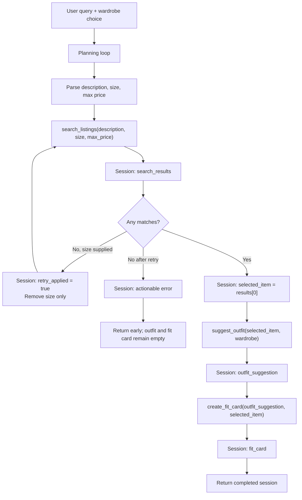

# FitFindr - Implementation Plan

This document was completed before implementation. It defines the tool contracts,
planning decisions, state shape, and failure behavior used by the code.

## Tools

### Tool 1: `search_listings`

**What it does:**
Searches the local mock marketplace dataset for listings that match the user's
description, optional size, and optional maximum price. Results are ranked by
weighted keyword relevance, with price used as a final tie-breaker.

**Input parameters:**

- `description` (`str`): Natural-language item description, such as
  `"vintage graphic tee"`.
- `size` (`str | None`): Optional requested size. Matching is case-insensitive
  and supports compound values such as `S/M` and `M/L`.
- `max_price` (`float | None`): Optional inclusive price ceiling in US dollars.

**What it returns:**
A `list[dict]` of complete listing records sorted best match first. Every record
contains `id`, `title`, `description`, `category`, `style_tags`, `size`,
`condition`, `price`, `colors`, `brand`, and `platform`. It returns `[]` when
there are no relevant matches or when the dataset cannot be loaded.

**What happens if it fails or returns nothing:**
The tool never raises a dataset or validation error to the planner; it returns
`[]`. The planner may retry once without the size constraint when a size was
provided. If the retry also returns nothing, the planner sets a specific error
message suggesting a broader description or higher budget and stops before
calling either LLM tool.

### Tool 2: `suggest_outfit`

**What it does:**
Creates one or two complete outfits centered on a selected listing. With a
populated wardrobe, it names actual wardrobe pieces; with an empty wardrobe, it
gives practical categories and colors to look for instead.

**Input parameters:**

- `new_item` (`dict`): One complete listing record selected from search results.
- `wardrobe` (`dict`): A wardrobe object with an `items` list. Each item has
  `id`, `name`, `category`, `colors`, `style_tags`, and optional `notes`.

**What it returns:**
A non-empty `str` containing specific styling advice and a complete outfit. It
uses Groq's `llama-3.3-70b-versatile` when available and a local rules-based
stylist if the API key, network, or service is unavailable.

**What happens if it fails or returns nothing:**
An empty wardrobe triggers useful general styling guidance instead of an error.
Malformed item input returns a clear message. Groq failures fall back to local
styling, so a temporary external service problem does not crash the agent.

### Tool 3: `create_fit_card`

**What it does:**
Turns an outfit suggestion and selected listing into a short, casual, shareable
caption that mentions the find, its price, platform, and outfit mood.

**Input parameters:**

- `outfit` (`str`): The non-empty suggestion returned by `suggest_outfit`.
- `new_item` (`dict`): The selected listing used in the outfit.

**What it returns:**
A non-empty `str` of two to four short sentences suitable for an outfit post.
Groq is called at a higher temperature for variation. A varied local caption
generator is used when Groq is unavailable.

**What happens if it fails or returns nothing:**
Blank outfit input returns: `"I need an outfit suggestion before I can create
a fit card."` Missing item details return a similarly specific message. API
failures use the local caption generator rather than exposing an exception.

## Planning Loop

`run_agent()` initializes a session and repeatedly checks a `next_step` value.
The loop has the following conditional branches:

1. `parse`: deterministically extract price and size from the query with regular
   expressions. Remove those filter phrases from the remaining text to form the
   search description. Store all three values in `session["parsed"]`.
2. `search`: call `search_listings()` and store the list in
   `session["search_results"]`.
3. If search is empty and a size was supplied and no retry has happened, append
   a planner event, set `session["retry_applied"] = True`, clear only the size
   constraint, and return to `search`.
4. If search is still empty, set `session["error"]` to an actionable message,
   set `next_step = "done"`, and do not call the remaining tools.
5. If search succeeds, store `results[0]` in `session["selected_item"]` and move
   to `style`.
6. `style`: call `suggest_outfit(selected_item, wardrobe)`. If it returns blank
   or an error-like message, set `session["error"]` and stop. Otherwise store it
   in `session["outfit_suggestion"]` and move to `card`.
7. `card`: call `create_fit_card(outfit_suggestion, selected_item)`. If it
   returns blank or an error-like message, set `session["error"]`; otherwise
   store it in `session["fit_card"]`. Then finish.

The loop is adaptive because no-results searches take a retry or early-return
branch, while successful searches continue through styling and captioning.

## State Management

One session dictionary is the single source of truth for a run. It stores the
original `query`, parsed filters, `search_results`, `selected_item`, `wardrobe`,
`outfit_suggestion`, `fit_card`, `error`, `retry_applied`, and a chronological
`planner_trace`. The exact dictionary in `selected_item` is passed to both
downstream tools, and the exact string in `outfit_suggestion` is passed into
`create_fit_card`; the user never has to re-enter tool output.

## Error Handling

| Tool | Failure mode | Agent response |
|---|---|---|
| `search_listings` | No relevant result | Retry once without size when possible. If still empty: explain that no match met the description and budget, suggest broader keywords or a higher budget, and stop. |
| `search_listings` | Dataset read/validation failure | Return `[]`; planner follows the same safe no-results path instead of crashing. |
| `suggest_outfit` | Wardrobe is empty | Generate a complete general outfit using recommended categories, proportions, and colors. |
| `suggest_outfit` | Groq is unavailable | Use the local wardrobe-aware stylist and record no user-facing crash. |
| `create_fit_card` | Outfit is empty | Return a specific message saying an outfit suggestion is required; planner stores it as an error and stops. |
| `create_fit_card` | Groq is unavailable | Generate a varied local caption from the listing and outfit. |

## Architecture

## AI Tool Plan

### Milestone 3 - Individual tool implementations

I will give Codex each tool block above, the starter docstring, and the data
loader interface one tool at a time. I expect implementations that preserve the
given signatures, use `load_listings()`, call Groq with
`llama-3.3-70b-versatile`, and return useful local fallbacks. Before accepting
the output, I will inspect filter behavior and prompts, then run pytest cases for
successful search, empty search, price filtering, empty wardrobe, malformed
inputs, and empty outfit text.

### Milestone 4 - Planning loop and state management

I will give Codex the Planning Loop, State Management, Error Handling, and
Architecture sections together with the starter `session` shape. I expect a
loop whose next action depends on session results, including an early stop and a
single loosened-size retry. I will verify the result by checking the planner
trace, object identity/value flow, success output, and no-results output where
`outfit_suggestion` and `fit_card` remain `None`.

### Milestone 6 - Interface and documentation

I will give Codex the implemented session contract and the README submission
requirements. I expect a responsive Gradio interface that visibly explains the
three stages, distinguishes fallbacks from successful matches, and maps session
state into clear output cards. I will verify it in a browser at localhost and
run both a happy path and a deliberate no-results path.

## A Complete Interaction (Step by Step)

**Example user query:**
`"I'm looking for a vintage graphic tee under $30, size M. I mostly wear baggy jeans and chunky sneakers."`

**Step 1 - Parse and search:**
The parser extracts `description="vintage graphic tee baggy jeans chunky
sneakers"`, `size="M"`, and `max_price=30.0`. The planner calls
`search_listings(description, size="M", max_price=30.0)`.

**Step 2 - Conditional result handling:**
The strict size search may return no result because the best graphic tee is
listed as `L`. The planner records the empty result, tells the session it is
loosening only the size filter, and calls
`search_listings(description, size=None, max_price=30.0)`. It selects the top
matching graphic tee and stores the complete listing in `selected_item`.

**Step 3 - Outfit suggestion:**
The planner calls `suggest_outfit(session["selected_item"],
session["wardrobe"])`. The result names the baggy dark-wash jeans, chunky white
sneakers, and a suitable layer from the example wardrobe. That exact string is
stored in `outfit_suggestion`.

**Step 4 - Fit card:**
The planner calls `create_fit_card(session["outfit_suggestion"],
session["selected_item"])` and stores the returned social caption in `fit_card`.

**Final output to user:**
The interface shows the selected listing with price, size, condition, platform,
and why a size fallback was used; a complete wardrobe-aware outfit; and a
shareable fit card. If both searches had failed, the interface would instead
show a concrete suggestion to broaden the description or budget and would leave
the downstream panels untouched.
